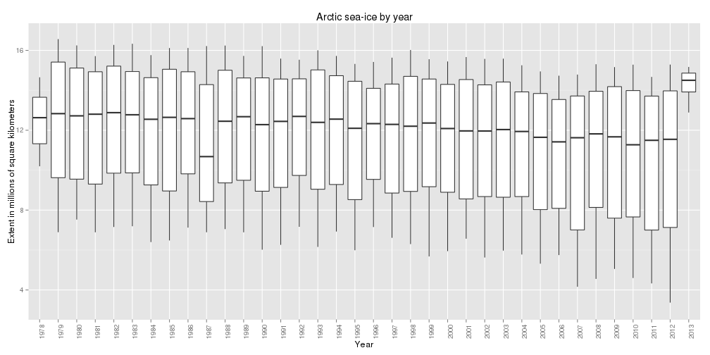
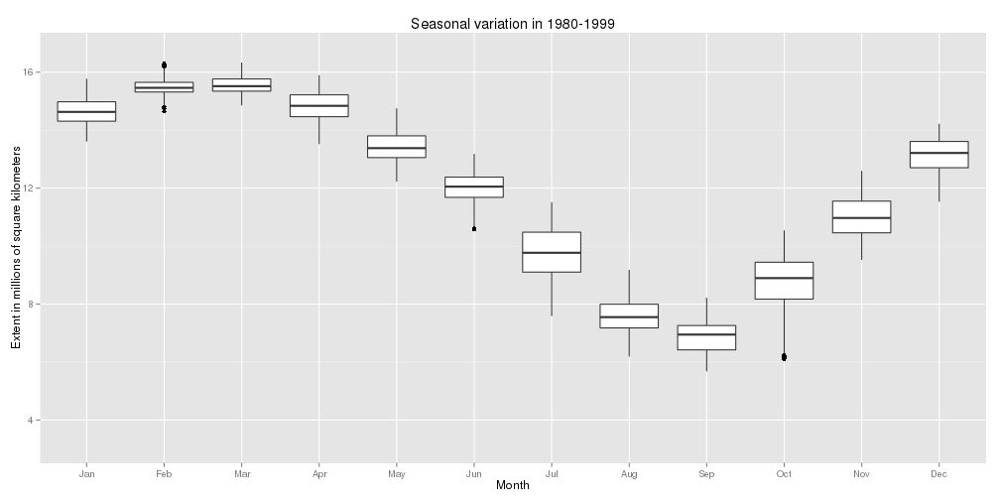
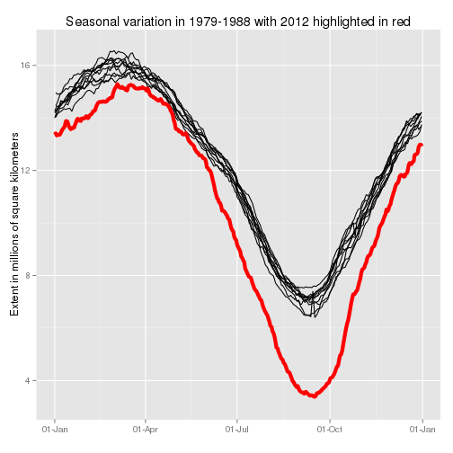

<!-- change the greenish title slide to blueish (for ice) -->

## Background

US [National Snow and Ice Data Center](http://nsidc.org/) measures the extent of Arctic sea-ice. [The project app](https://johanna.shinyapps.io/Project) aims to illustrate the diminishing trend in Arctic sea-ice by letting the user explore the measurements available at UsingR package in a dashboard-like fashion.

The application supports three types of graphics that are all demonstrated on the following slides.

1. an annual timeseries as boxplot 
2. seasonal variation as monthly boxplot
3. seasonal variations as lines for each year with a selected year highlighted in red

The user can choose the range of years pictured.

[R-bloggers](http://www.r-bloggers.com/arctic-sea-ice-at-lowest-levels-since-observations-began/) inspired the line chart with a highlighted year.

--- 

## Annual time series shows a diminishing trend

 

---- 

## Monthly boxplot illustrates the seasonal variation

 

--- &twocol

## Line chart with a highlighted year combines the two

*** =left
 

*** =right

 

*** =fullwidth

Credits for the two-column layout go to [Zev Ross](http://zevross.com/blog/2014/11/19/creating-elegant-html-presentations-that-feature-r-code/).
